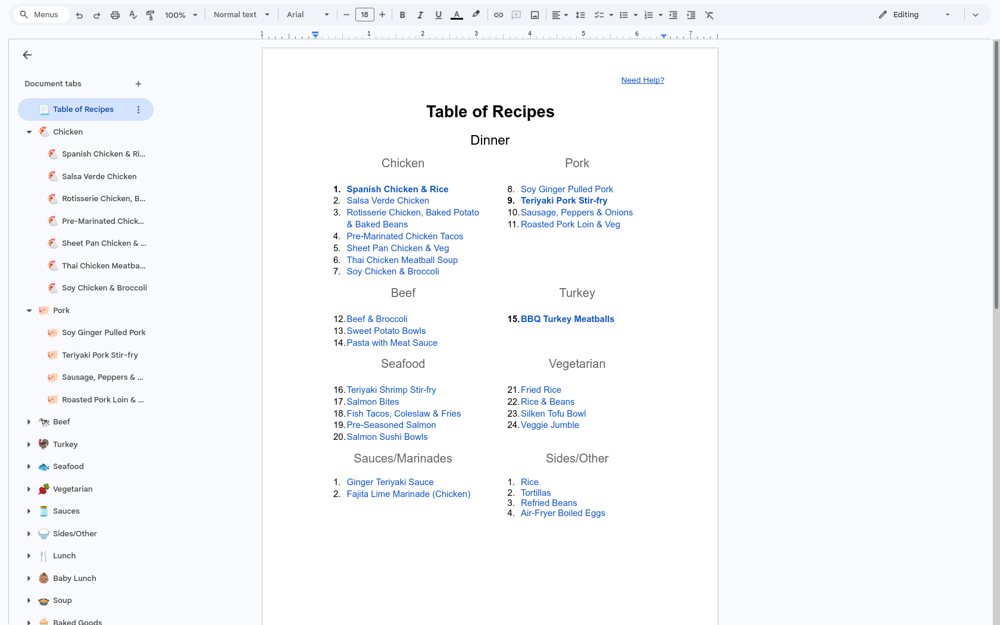
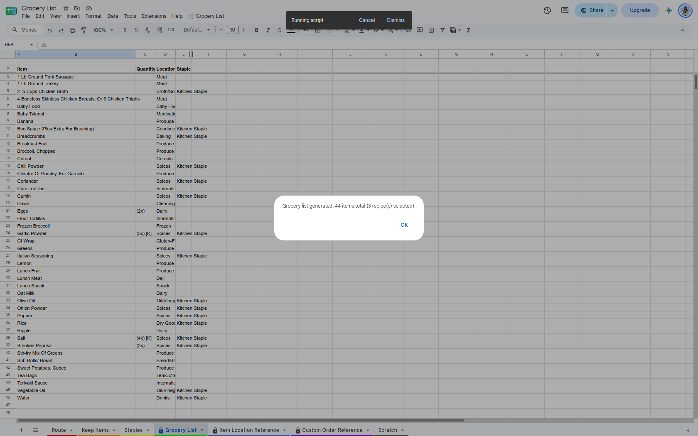
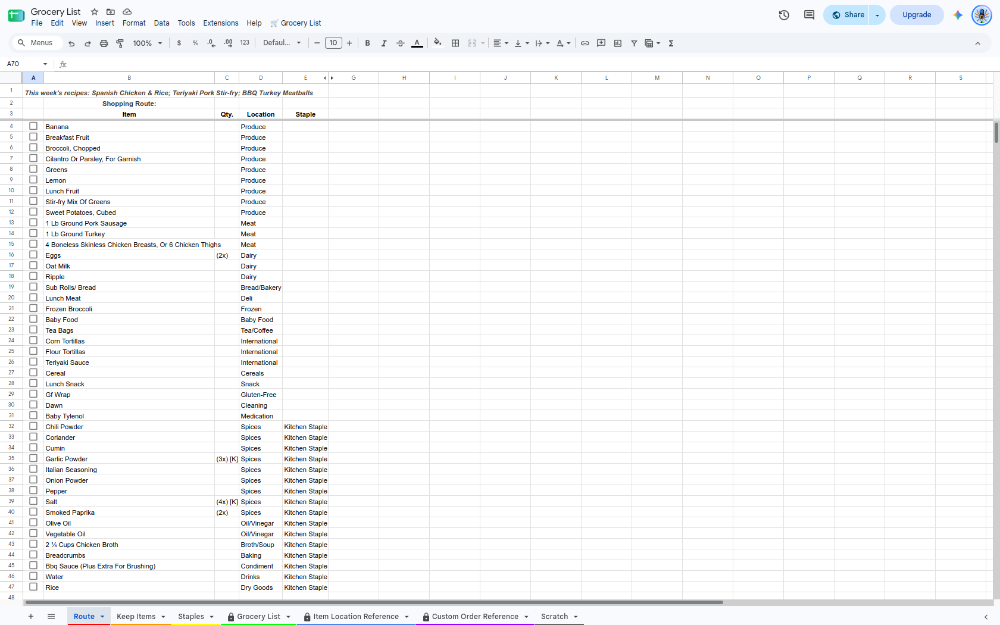

# Recipe & Keep Automated Grocery List Generator 🛒

A multi-source grocery list generator and store routing engine built with **Google Apps Script**, **JavaScript**, and **Google Workspace APIs** (Docs, Sheets, Gmail). 

This system parses bolded recipes from a master Google Doc, ingests quick notes via Gmail/Google Keep, merges recurring staples, deduplicates items, and constructs an automatically sorted, interactive shopping route in Google Sheets.

---

## Table of Contents
- [Project Overview](#project-overview)
- [Visual Overview](#visual-overview)
- [Key Features](#key-features)
- [System Architecture](#system-architecture)
- [Technical Capabilities](#technical-capabilities)
- [Repository Structure](#repository-structure)
- [License](#license)

---

## Project Overview

Planning weekly grocery runs across multiple recipes, static kitchen staples, and temporary ad-hoc notes usually involves tedious manual cross-referencing.

This project automates that entire process:
1. **Selection:** Users bold recipe titles in a master Google Doc recipe book.
2. **Ingestion:** The script scans the Google Doc for selected recipes (including recursive sub-recipes) and automatically pulls unread notes from Gmail/Keep via automated label filters.
3. **Consolidation:** Ingredients are merged with static staple items, cleaned via Regular Expressions (with protein quantity preservation), and deduplicated.
4. **Execution:** Generates a primary `Grocery List` and an optimized `Route` tab that dynamically ranks items by store location, kitchen staple status, and debounced interactive checkbox sorting.

---

## Visual Overview

### 1. Recipe Selection (Google Doc)


### 2. List Generation (Google Sheets)


### 3. Optimized Store Route (Output)


---

## Key Features

- **Multi-Source Data Ingestion:**
  - **Google Docs API:** Parses structured recipe tables and extracts ingredient lists from active tabs.
  - **Recursive Sub-Recipe Expansion:** Detects sub-recipes mentioned inside main recipes (e.g., sauces or bases) and recursively fetches their ingredient trees.
  - **Gmail Auto-Import (`pullKeepFromGmail`):** Scans unread emails under a designated label, filters out completed checkmarks (`[X]`), strips unchecked boxes, and updates dynamic items.
- **Smart Ingredient Normalization:**
  - **RegEx Quantity Stripping:** Uses Regular Expressions to remove unit descriptors (e.g., "cups", "tbsps", "cloves") so items like "2 eggs" and "3 large eggs" merge cleanly under "Eggs".
  - **Protein Keyword Preservation:** Preserves exact measurement strings for designated protein items (e.g., "chicken", "beef", "salmon") so specific cut weights are not lost.
- **Interactive Store Route & Debounced Sorting (`onEdit`):**
  - **Location Reference Lookup:** Programmatically writes dynamic array lookup formulas (`IFERROR/INDEX/MATCH`) to assign aisle locations to each item.
  - **Custom Store Sorting:** Sorts items on a `Route` tab according to custom aisle preference orders.
  - **Debounced Checkbox Logic:** Uses `CacheService` in the `onEdit` trigger to handle rapid checkbox clicks, cleanly delaying sorting operations until the user finishes checking off items.
- **Full-Stack Access:** Includes a built-in Google Apps Script Web App entry point (`doGet`) for mobile browser execution alongside native Google Sheets UI menus.

---

## System Architecture


```

┌───────────────────────────┐      ┌───────────────────────────┐      ┌───────────────────────────┐
│     Master Google Doc     │      │     Gmail Keep Import     │      │    Staples & Reference    │
│   (Bolded Recipes & Tabs) │      │   (Unread Label Emails)   │      │      (Google Sheets)      │
└─────────────┬─────────────┘      └─────────────┬─────────────┘      └─────────────┬─────────────┘
              │                                  │                                  │
     Docs API / Parsing                    GmailApp API                     SpreadsheetApp API
              │                                  │                                  │
┌─────────────▼──────────────────────────────────▼──────────────────────────────────▼─────────────┐
│                                    Google Apps Script Engine                                    │
│  • Recursive Sub-Recipe Extraction          • RegEx Ingredient Cleaning & Protein Rules         │
│  • Title Case Standardizing                 • Multi-Source Deduplication & Counting             │
│  • CacheService Debounced onEdit Sorting    • Dynamic Formula Writing (INDEX / MATCH)           │
└────────────────────────────────────────────────┬────────────────────────────────────────────────┘
                                                 │
                                      SpreadsheetApp Output
                                                 │
┌────────────────────────────────────────────────▼────────────────────────────────────────────────┐
│                                     Google Sheets Outputs                                       │
│  • Grocery List Tab: Consolidated items, notes, quantities, and formula-backed locations.       │
│  • Route Tab: Store-aisle ordered shopping list with interactive auto-sorting checkboxes.       │
└─────────────────────────────────────────────────────────────────────────────────────────────────┘

```

---

## Technical Capabilities

- **`Google Docs API (v1)`**: Used alongside `includeTabsContent` to navigate multi-tab document hierarchies and parse nested table paragraphs.
- **`Regular Expressions (RegEx)`**: Custom regex patterns handle unit removal, fractional numbers, unicode characters (`¼`, `½`), and case-insensitive keyword matching.
- **`CacheService` & Debouncing**: Prevents execution race conditions during rapid cell edits on mobile devices by tracking timestamps in a 20-second cache.
- **`Batch Sheet Updates`**: Utilizes advanced Google Sheets API calls to batch-delete native table objects and refresh output ranges cleanly.

---

## Repository Structure


```

├── images/
│   ├── 1.Table_of_Recipes.png          # Input recipe book selection screenshot
│   ├── 2.Generated_Grocery_List.png    # Execution dialog screenshot
│   └── 3.Optimized_Route_List.png      # Final route & checkbox output screenshot
├── src/
│   ├── Code.gs                         # Core Google Apps Script automation logic
│   └── Index.html                      # Web App frontend template for mobile access
├── LICENSE                             # MIT License
└── README.md                           # Main project documentation

```

---

## License

This project is open source and available under the [MIT License](LICENSE).
